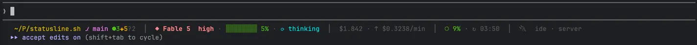

# statusline.sh

A blazing-fast statusline for [Claude Code](https://claude.com/claude-code), packed into a single bash script. No npm, no Python, no weird dependencies — drop in one file and get all of this (don't want a segment? [flip it off](#configuration)):



```
 ~/w/payments-api ⎇ PAYM-1234 ●2✚1?3 · ☕ 21  │  ◆ Opus 4.8  high · ███░░░░░ 38% · ⚙ running  │  $1.234 · ↑ $0.0512/min  │  ◑ 42% · ↻ 16:13  │  🔌 github · Gmail
└───────────────────┬───────────────────────┘  └──────────────────────┬─────────────────────┘  └──────────┬────────────┘  └────────┬───────┘  └─────────┬────────┘
          path · git · tech stack                   model · effort · context bar · activity          cost · burn rate        5h rate limit          MCP servers
```

## Features

**Where you are**

- **Path & git** — abbreviated path, branch, and counts of staged `●`, unstaged `✚`, and untracked `?` files.
- **Tech stack** — the project's language and version (Java, Node, Go, Rust, Python).

**What Claude is doing**

- **Model & effort** — the active model (color-coded: `◆ Opus 4.8`, `◆ Sonnet 4.6`, …) and its effort level.
- **Context bar** — how full the context window is, green → orange → red.
- **Live activity** — whether Claude is `waiting` on you, `⚙ running` a tool, or `⟳ thinking`.

**What it's costing you**

- **Burn rate** — how fast you're spending: `$/min` alongside total session cost.
- **5h rate limit** — usage gauge (`○ ◔ ◑ ◕ ●`) and reset time (Pro/Max plans).

**What's connected**

- **MCP servers** — which servers have actually been used this session.

If some info isn't available (not in a git repo, session just started, …), that segment is simply hidden — never an error or broken output.

## Requirements

- `bash` 3.2+ (macOS default works) and `jq`
- macOS or Linux (on Windows, use WSL)

## Install

```bash
curl -fsSL https://raw.githubusercontent.com/JPedroBorges/statusline.sh/main/install.sh | bash
```

The installer downloads `statusline.sh` to `~/.claude/statusline.sh` and wires it into `~/.claude/settings.json` (backing up the original). It won't overwrite an existing statusline config — it tells you what to change instead.

### Manual install

```bash
curl -fsSL https://raw.githubusercontent.com/JPedroBorges/statusline.sh/main/statusline.sh -o ~/.claude/statusline.sh
chmod +x ~/.claude/statusline.sh
```

Then add to `~/.claude/settings.json`:

```json
{
  "statusLine": {
    "type": "command",
    "command": "~/.claude/statusline.sh",
    "padding": 0
  }
}
```

## Configuration

Every segment is a `0`/`1` flag, defaulting to on. Set them in `~/.claude/statusline.conf` (a plain shell file, sourced if present) — or just edit the defaults at the top of the script if you don't intend to update: the conf file only exists so upgrades don't wipe your settings.

```bash
# ~/.claude/statusline.conf
SHOW_BURN=0
SHOW_ONLY_TICKET=0
```

| Flag               | Controls                                                 |
|--------------------|----------------------------------------------------------|
| `SHOW_DIRTY`       | git dirty counts (staged `●` unstaged `✚` untracked `?`) |
| `SHOW_ONLY_TICKET` | show the JIRA ticket ID instead of the full branch name  |
| `SHOW_TECH`        | language/version icon (☕ ⬡ 🦀 🐍 go)                     |
| `SHOW_ACTIVITY`    | waiting / running / thinking indicator                   |
| `SHOW_COST`        | total session cost                                       |
| `SHOW_BURN`        | $/min burn rate                                          |
| `SHOW_LIMITS`      | 5h rate-limit gauge + reset time                         |
| `SHOW_MCP`         | MCP servers used this session                            |

## How it works

Claude Code pipes a JSON payload (model, cwd, cost, context usage, transcript path, rate limits) to the statusline command on every render. The script parses it with a single `jq` call, then:

- **Tech stack** is detected from config files alone (`pom.xml`, `package.json`, `go.mod`, `Cargo.toml`, …) — no runtime is ever launched.
- **Activity** comes from the last `user`/`assistant` entry in the transcript tail: an assistant message ending in text means Claude is waiting; a `tool_use` block means a tool is running; anything mid-stream means it's thinking.
- **Burn rate** is a rolling ~5-minute window: a tiny state file in `$TMPDIR` per session holds a window start time and cost, resampled every ~5 minutes.
- **MCP detection** greps the transcript for `mcp__server__tool` invocations, caching a byte offset so each render only scans what's new. Disabled servers from `~/.claude.json` are filtered out.

## Uninstall

```bash
rm ~/.claude/statusline.sh
```

and remove the `statusLine` block from `~/.claude/settings.json`.

## License

[MIT](LICENSE)
